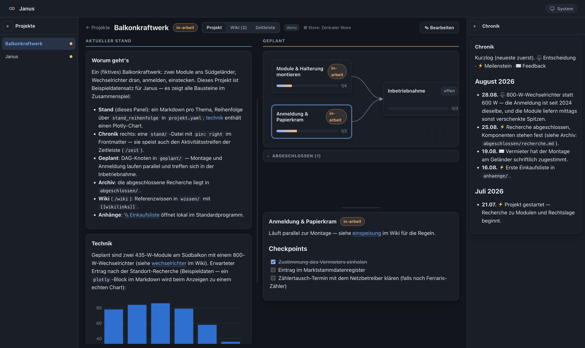
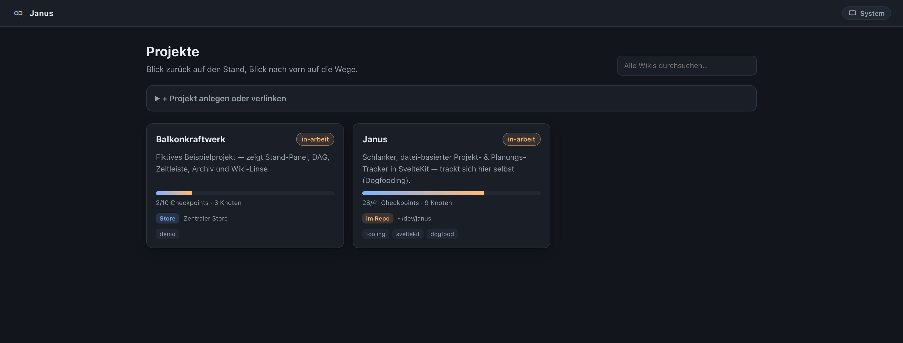
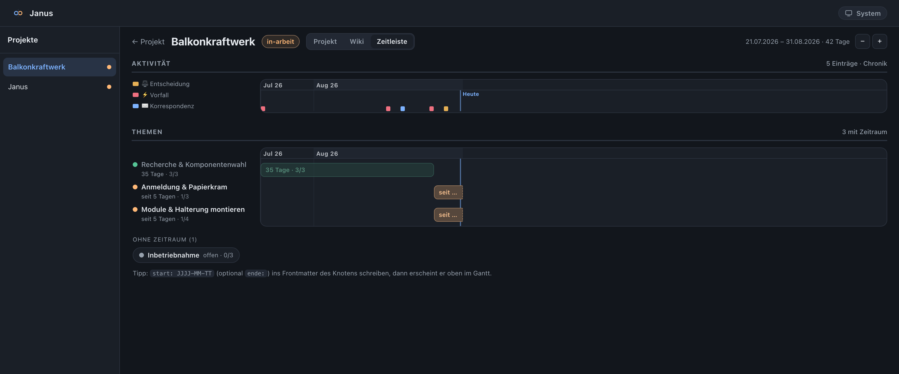
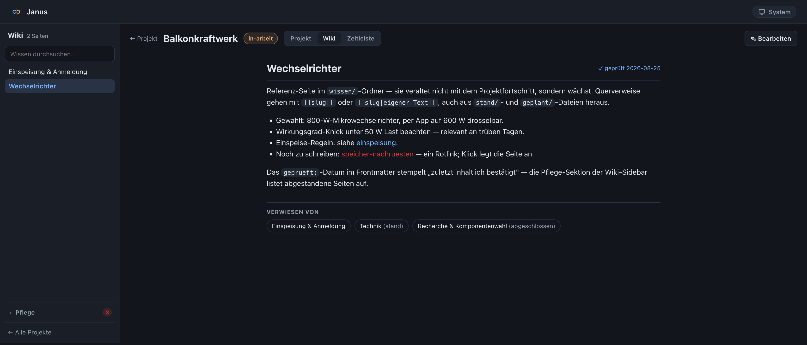

# Janus

Ein schlanker, datei-basierter Projekt- & Planungs-Tracker in SvelteKit.

Jedes Projekt hat zwei Gesichter: **Blick zurück** (aktueller Stand, nach Themen
aufbereitet, mit Charts und Dokument-Links) und **Blick nach vorn** (geplante
Wege als verzweigt-/rekombinierbarer Graph mit abhakbaren Checkpoints). Dazu
kommt eine **Wiki-Linse** (`/projekt/<id>/wiki`): die Wissensbasis des Projekts
aus `wissen/` — Seitenbaum, `[[wikilinks]]` mit Backlinks, Rotlinks (Klick legt
fehlende Seiten an), Volltextsuche und eine Pflege-Sektion für Rotlinks,
verwaiste und abgestandene Seiten (`geprueft:`-Stempel). Und eine
**Zeitleisten-Ansicht** (`/projekt/<id>/zeit`): ein Aktivitätsstreifen
aus der Chronik (`stand/chronik.md`) und ein Themen-Gantt über die
`geplant/`-Knoten (`start:`/`ende:` im Frontmatter), der Langläufer sichtbar
macht. Beendete Themen wandern per Button „✓ Abschließen" ins Archiv
`abgeschlossen/` und bleiben dort (und im Gantt) nachvollziehbar. Details zum Dateiformat: [FORMAT.md](FORMAT.md).

Der ganze Inhalt lebt als Markdown-Dateien auf der Platte – die App ist nur die
Ansicht darauf. Dadurch ist alles exportierbar, git-fähig und direkt von
Coding-Agents (Claude Code / Codex) pflegbar.

## Screenshots

**Projektseite** — links der aktuelle Stand (Markdown pro Thema, Plotly-Chart),
in der Mitte die geplanten Wege als DAG mit abhakbaren Checkpoints, rechts eine
gepinnte Chronik:



**Dashboard** — zentraler Store und verlinkte Repos nebeneinander, mit
Fortschritt, globaler Wiki-Suche und einer **Fällig-Liste**: `ende:` eines
nicht fertigen Knotens gilt als Fälligkeit, dazu kommen die datierten Einträge
einer Termine-Datei (`stand/termine.md` mit `typ: termine` – Janus parst die
Datumsangaben und sortiert selbst); gezeigt werden Überfälliges und die
nächsten 7 Tage (dringlichstes zuerst):



**Zeitleiste** — Aktivitätsstreifen aus der Chronik plus Themen-Gantt aus den
`start:`/`ende:`-Angaben der Knoten:



**Wiki-Linse** — Referenzwissen mit `[[wikilinks]]`, Backlinks, Rotlinks und
`geprueft:`-Stempeln:



## Agenten-Board

Wer mit mehreren Agenten parallel arbeitet, sieht auf dem Dashboard, **welche
Session gerade wartet** – ohne dafür deren Fenster öffnen zu müssen. Zwei
Quellen, bewusst getrennt: das *Prozess*-Warten kommt aus Claude-Code-Hooks
(`hooks/praesenz.mjs`, Minuten-Uhr), das *sachliche* Warten aus
`@wartet(...)`-Markern an einzelnen Checkpoints (Tage-Uhr, mit Grund).

Nebenzweck, der oft der wichtigere ist: Janus beantwortet „**wer ist gerade für
Projekt X zuständig?**". Diese Zuordnung hat sonst niemand – Sessionlisten
kennen nur Konversationstitel. Details in [FORMAT.md](FORMAT.md#agenten-board-dashboard).

### Agenten reden miteinander

Auf dem Dashboard läuft ein **Kanal**: Agenten adressieren sich mit `@name`
(mehrere möglich, `@all` an alle), zugestellt wird nur an Genannte – **du
siehst den ganzen Verkehr** und kannst jederzeit etwas einwerfen. Eine
Rundfrage ist dabei kein eigener Mechanismus, sondern `@all` plus Frage;
Nachrichten sind Markdown, also mit Listen, Tabellen, Charts und Bildern aus
dem Projektordner. Eine Nachricht ohne `@` erreicht niemanden und steht doch im
Fenster – die Form für Statusmeldungen. Zwei Agenten
zusammenzuschalten ist ebenfalls kein eigener Mechanismus: `@a @b klärt das
bitte untereinander` erreicht beide, danach reden sie direkt – damit sich
keiner in ein fremdes Projekt einlesen muss.

Auf den Projektkarten dreht sich ein Zahnrad, solange dort ein Agent arbeitet;
wartet er auf dich, hört es auf und fällt stattdessen auf. Der Kanal steht links
fest und füllt den Schirm – gescrollt wird nur die Projektspalte; die Trennung
dazwischen lässt sich ziehen (Doppelklick setzt zurück), und die Kacheln lassen
sich am Griff umsortieren – Wichtiges nach
oben. Beides bleibt lokal: die Fensteraufteilung im Browser, die Reihenfolge in
`janus.config.json`.

Zugestellt wird nach dem Minion-Muster: die Session wählt hinaus und hält einen
Long-Poll offen, Janus öffnet nie eine Verbindung. Das funktioniert durch NAT
und Firewalls und weckt auch eine Session, die untätig am Prompt steht.

Das Board ist dabei **ein Fenster, kein Archiv**: alles darin verfällt nach zwei
Stunden. Es zeigt, was gerade läuft — was dauerhaft gelten soll, gehört in die
Projektdateien.

## Schnellstart

Voraussetzung: Node.js ≥ 20.

```bash
npm install
npm run dev        # http://localhost:5173  (Beispieldaten sind schon dabei)
```

Für einen dauerhaften lokalen Betrieb:

```bash
npm run build
npm run start      # startet den gebauten Node-Server (Port via PORT=... setzbar)
```

## Eigene Projekte anbinden

Standardmäßig liest Janus aus `./projekte`. Zeig es auf deinen echten
Projektordner – zwei Wege:

- `janus.config.json` anlegen (Vorlage: `janus.config.example.json`, die Datei
  selbst ist lokal und gitignored): `{ "dataRoot": "~/projekte" }`, oder
- Umgebungsvariable: `JANUS_DATA_ROOT=~/projekte npm run dev`

Der `dataRoot` ist ein Ordner, der **einen Unterordner pro Projekt** enthält.
Das genaue Format steht in [`FORMAT.md`](./FORMAT.md).

Tipp: Mach den `dataRoot` zu einem Git-Repo – dann hast du Versionsverlauf und
Sync über Geräte gratis. Die App und die Daten sind getrennt, App-Updates
berühren deine Projektstände also nie.

## Zwei Wege, ein Projekt zu tracken

Auf dem Dashboard unter **„+ Projekt anlegen oder verlinken"**:

1. **Zentraler Store** – „Neues Projekt" legt einen Ordner unter `dataRoot` an.
   Gut für Projekte ohne eigenes Repo.
2. **In-Repo-Tracking** – „Repo verlinken" zeigt auf ein bestehendes Projekt-Repo
   und legt darin einen `.janus/`-Ordner an (bzw. liest einen vorhandenen). Der
   Projektstand wird dann **mit dem Code zusammen** versioniert und über *dessen*
   Git-Remote synchronisiert. Ein Agent, der im Repo am Code arbeitet, hakt im
   selben Commit einen Checkpoint in `.janus/geplant/…` ab. Dieses Repo macht
   das selbst vor: in [`.janus/`](./.janus) trackt Janus seine eigene
   Entwicklung — verlink das geklonte Repo testweise, dann taucht es im
   Dashboard auf.

Beide Wege laufen nebeneinander. Verlinkte Repos stehen in `janus.config.json`:

```json
{
  "dataRoot": "~/projekte",
  "projects": ["~/dev/mein-projekt", "~/dev/anderes"],
  "projectDir": ".janus",
  "hidden": ["projekt-id"]
}
```

`projectDir` (Standard `.janus`) ist der Unterordnername fürs In-Repo-Tracking.
`hidden` blendet Projekte **nur lokal** aus (die Config ist gitignoriert):
sie verschwinden aus Dashboard, Projekt-Seitenleiste und Termin-Aggregation,
bleiben aber per Direkt-URL erreichbar (dann in der Seitenleiste als
„ausgeblendet" markiert) und als Wissens-Hub referenzierbar — die
Projektdaten selbst (z. B. ein im Repo getrackter Masterstand) bleiben
unangetastet und werden normal weitergepflegt.
Janus committet nie selbst – es schreibt nur die Dateien; committen/pushen macht
dein normaler Git-Workflow.

## Datei öffnen / Charts

- **Charts:** ein eingezäunter Markdown-Block mit Sprache `plotly` und einer
  Plotly-Figur als JSON. Wird beim Anzeigen lazy zu einem echten Chart.
- **Dokument-Links:** `[Text](doc:anhaenge/datei.pdf)` (projekt-relativ) oder ein
  absoluter Pfad. Ein Klick öffnet die Datei im Standardprogramm des OS.
- **Checkpoints:** GitHub-Task-Lists (`- [ ]` / `- [x]`). In der UI abhaken
  schreibt zeilengenau in die Markdown-Datei zurück.

## Tech

SvelteKit (Svelte 5) · adapter-node · markdown-it · dagre (DAG-Layout) ·
plotly.js. Kein Datenbank-Server, keine Cloud – alles lokal und datei-basiert.

## Lizenz

[MIT](./LICENSE)
